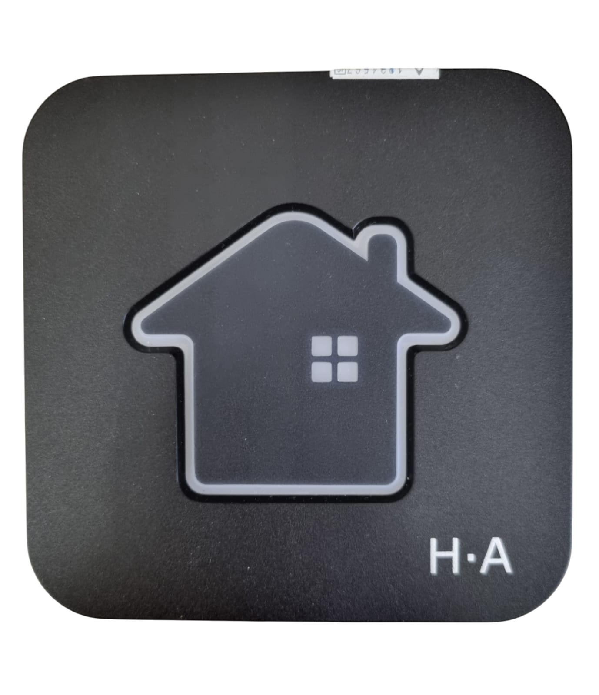
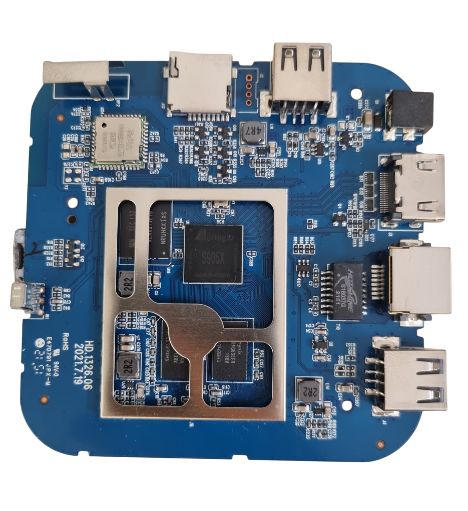

#  Descaracterização do modelo HA

## 🔎 Sumário

- [Informações Gerais](#💻-informações-gerais)
  - [Valores de Hardware](#valores-de-hardware)
  - [Imagem do modelo](#imagem-do-modelo)
  - [Sistema operacional original](#sistema-operacional-original)
  - [Suporte de rede](#suporte-de-rede)
- [Desempenho](#📈-desempenho)
- [Ferramentas utilizadas para descaracterização](#🛠-ferramentas-utilizadas-para-descaracterização)
  - [Hardware](#hardware)
  - [Software](#software)
- [Descaracterização: Processo detalhado](#📖-descaracterização-processo-detalhado)
  - [Cuidados necessários](#cuidados-necessários)
  - [Inicializando o Armbian na TV Box pelo cartão SD](#inicializando-o-armbian-na-tv-box-pelo-cartão-sd)
  - [Configuração inicial do Armbian](#configuração-inicial-do-armbian)
  - [Instalação do sistema no armazenamento interno](#instalação-do-sistema-no-armazenmento-interno)
- [Erros comuns](#❌-erros-comuns)

### Valores de Hardware

(Os valores na tabela abaixo foram obtidos por meio da plataforma AIDA64)

| Medida                   | Valor detectado | Valor nominal |
| ------------------------ | --------------  | ------------- |
| CPU S905X                |     1,512 GHz   |     1,5 GHz   |
| Armazenamento interno    |     10,85 GB    |      16 GB    |
| Memória RAM              |     1,734 GB    |      2 GB     |

### Imagem do Modelo

|Box          | Circuito   |
|-------------|------------|
|  | 

### Sistema Operacional Original

Android: 7.1.2
Kernel: 3.14.29

### Suporte de Rede

O módulo de rede identificado para esse modelo é o: **Realtek rtl8723ds**, para o qual o driver correspondente é **rtl8723ds**.

- Wi-fi: Suporte completo.
- Bluetooth: Ainda não testado.<!-- Necessário confirmar -->
- Ethernet: Suporte completo.

## 📈 Desempenho

Confira nossa [metodologia de avaliação](material-de-apoio/glossario.md). <!-- Necessário criar arquivo de metodologia e linkar aqui -->

| Atividades                   | Avaliação     |
| ---------------------------- | --------------|
| Navegar em páginas           | 🟠 MÉDIO      |
| Assistir vídeos              | 🔴 MÉDIO      |
| Jogar                        | 🔴 RUIM       |
| Utilizar como servidor       | 🟢 BOM        |

## 📖 Descaracterização: Processo detalhado

### Cuidados necessários

- Sempre ejete o cartão SD pelo sistema operacional antes de removê-lo do computador.
- Baixe a imagem correta do Armbian. Os testes indicaram que as imagens customizadas fornecidas pelo repositório [ophub](https://github.com/ophub/amlogic-s9xxx-armbian/releases) tem uma maior compatibilidade para este modelo de processador em relação aos sistemas oficiais do projeto Armbian. As demais apresentaram diversos problemas de inicialização.

### Inicializando o Armbian na TV Box pelo cartão SD

_Disclaimer1: Caso algum termo não seja compreendido, verifique-o na seção [glossário](../../material-de-apoio/glossario.md)_

_Disclaimer2: Muitos modelos com [SoC](../../material-de-apoio/glossario.md#SoC) Amlogic S905X3 tiveram problema de compatibilidade com as imagens oficiais geradas pelo projeto Armbian, isso se deve em especial por causa do u-boot, responsável por inicializar o sistema. Para isso foram encontradas duas soluções: modificiar manualmente os scripts para inicializar o sistema através de bootloader proprietário, ou utilizar imagens de um projeto extra-oficial, que possuem u-boots selecionados para cada arquivo [dtb](../../material-de-apoio/glossario.md#dtb). Aqui utilizaremos a segunda solução._

1. Baixe os software e arquivos necessários no computador/notebook.

- Software de criação de mídia bootável (baixe apenas um de sua escolha)
  - Recomendado: [Balena Etcher (Tutorial de instalação e uso)](https://etcher.balena.io/)
  - Alternativa: [Rufus (Tutorial de instalação e uso)](https://rufus.ie/pt_BR/)
  - Alternativa: [dd (Tutorial de uso)](https://medium.com/@emusyoka759/creating-a-bootable-usb-in-ubuntu-with-dd-9fb3debc0814)
- Imagem do Armbian (variante do projeto ophub)
  - [Armbian_23.8.1 Kernel 6.1.50 com desktop e interface gráfica XFCE](https://unioestebr-my.sharepoint.com/:u:/g/personal/renan_silva15_unioeste_br/EYO_IaHxLcxDrQMYyfNis-wBRl-OuYIk0nvXUq9LoGC1wA?e=gPsRky)
  
2. No computador/notebook, insira o cartão SD e Utilize um dos programas anteriores para gravar a imagem no cartão SD.
3. Entre no diretório raiz do cartão SD após a gravação da imagem, onde diversas pastas e arquivos com extensão .bin podem ser encontrados.
4. Abra o arquivo extlinux.conf na pasta extlinux com um editor de texto qualquer e substitua o que estiver escrito após a última barra na linha que começa por "FDT" por "meson-gxl-s905x-p212.dtb". Salve o arquivo e feche.
5. Faça uma cópia do arquivo u-boot-s905x-s912.bin, também presente no diretório raiz do cartão SD, e renomeie essa cópia para u-boot.ext.
6. Remova o cartão SD do computador/notebook.

- Ejete o cartão SD pelo sistema operacional antes de removê-lo, para evitar possível corrupção.

7. Insira o cartão SD na HA desligada e conectada à um monitor/televisão por cabo HDMI.
8. Pressione o botão reset com um clip de papel desdobrado ou um palito de dente (o botão pode ser encontrado dentro de um "furo" na parte debaixo da TV Box) e conecte a fonte de alimentação enquanto o botão ainda estiver pressionado. Mantenha o botão de reset pressionado e solte assim que algum sinal de vídeo for observado no monitor/televisão.

⚠️Lembre-se⚠️: o sistema está funcionando por meio do cartão SD, ou seja, caso removido, o firmware original da tv box ascenderá novamente, mas nunca retire o cartão SD com o aparelho ligado. Um tópico mais a frente ensinará a gravar o sistema no armazenamento interno, apagando todo o firmware original da TV Box.

### Configuração inicial do Armbian

Após iniacializar o sistema pela primeira vez, é pedido ao usuário que forneça algumas informações de configuração, como nome de usuário, senha, configuração de zonas de tempo e afins. O processo é bem intuitivo. mas caso haja dúvida, utilize o nosso [guia para configuração inicial do Armbian](#).

### Instalação do sistema no armazenmento interno

⚠️Cuidado⚠️: Esta ação vai apagar todos os dados presentes no armazenamento da sua TV Box, convém fazer um backup.

⚠️Lembre-se⚠️: para cumprir esta etapa, é muito importante que uma cópia do u-boot correto tenha sido feita, conforme a etapa 5 do [**Inicializando o Armbian na TV Box pelo cartão SD**](##inicializando-o-armbian-na-tv-box-pelo-cartão-sd).

Após a configuração, execute os comandos

```bash
sudo su
cd /root
sudo ./aml-install.sh
```

e aguarde a instalação.

## ❌ Erros comuns

1. Caso não seja identificado sinal de vídeo após cumprida a etapa 8 do tópico "Inicializando o Armbian na TV Box pelo cartão SD", verifique se o cabo HDMI funciona e está conectado corretamente. Em caso afirmativo, tudo indica que o sistema foi identificado, mas não é compatível.
2. Caso a TV Box inicialize pelo sistema original, é provável que o botão de reset não tenha isdo pressionado por tempo suficiente ou que no cartão SD não tenha sido encontrado um sistema para inicializar. Convém tentar conectar o cartão SD às entradas USB por meio de um adaptador.